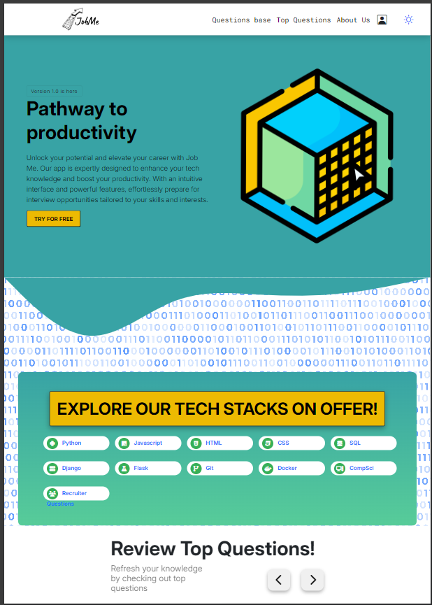

# Job Me



As part of the Code Institute's October Hackathon, Team 3: The Gig Getters built from scratch a project called **"Job Me"**. This entirely free all-in-one platform was designed to provide Software Developers with a comprehensive suite of resources to help them secure their ideal roles. Tailored to developers of all technical backgrounds, skill levels, and experience, this one-stop-shop simplifies job hunting while offering:

- Mock interview simulations
- Progress tracking tools
- Coding challenges
- Access to key tech stacks like Python, JavaScript, and SQL

With full **CRUD (Create, Read, Update, Delete)** functionalities, users can easily manage profiles and track progress. It also includes interactive features like a **card carousel** for exploring top interview questions, helping developers deepen their skills in relevant tech stacks.

Built using modern technologies such as **Bootstrap** and **Django**, "Job Me" also provides Users with a **responsive design**, **dark mode toggling**, and **mobile-friendly navigation**. Its dynamic interface ensures developers are well-prepared to pursue roles that align with their career goals.

## Table of Contents

- [Features](#features)
- [Color Scheme](#color-scheme)
- [Technologies Used](#technologies-used)
- [Contributing](#contributing)
- [Credits](#credits)
- [Acknowledgements](#acknowledgements)
- [License](#license)

## [Features](#features)

Key features of the project:

- Feature 1
- Feature 2
- Feature 3

## [Color Scheme](#color-scheme)

The following color scheme is used throughout the project, optimized for both light and dark modes.

| Color Category        | Color Name         | Hex Code   | Usage                                      |
|-----------------------|--------------------|------------|--------------------------------------------|
| **Primary Color**      | Main Dark          | `#3a3a4a`  | Headings and paragraphs in light mode      |
| **Secondary Color**    | Main Medium        | `#555555`  | Subheadings in dark mode                   |
| **Accent Color**       | Main Green Light   | `#36AF57`  | Buttons (default)                          |
| **Hover Accent Color** | Main Green Dark    | `#2B8C46`  | Buttons (hover)                            |
|                       | Main Lightest      | `#ffffff`  | Background in light mode                   |
|                       | Main Light         | `#cccccc`  | Subheadings in light mode                  |
|                       | Box Light Background | `#F1F1F1` | Box background in light mode               |
|                       | Box Background Dark | `#cccccc`  | Box background in dark mode                |

### CSS Color Variables

Below are the CSS variables defining the color scheme used in this project:

```css
:root {
    --main-lightest: #ffffff; 
    --main-light: #cccccc;
    --main-med: #555555;
    --main-dark: #3a3a4a;
    
    /* Button Colors */
    --main-green-light: #36AF57;
    --main-green-dark: #2B8C46;
    
    /* Box Colors */
    --box-light-background-light: #F1F1F1;
    --box-background-dark: #cccccc;
}
```

[Click Here](https://github.com/ShaAnder/elevate_hackathon_2024/tree/main/static/css) to navigate to the folder containing the project's CSS files.

## [Technologies Used](#technologies-used)

Below is a list of technologies and frameworks used in the project:

- HTML5
- CSS3
- JavaScript (ES6+)
- Bootstrap
- Django

## [Contributing](#contributing)

Guidelines for contributing to the project:

1. Fork the repository
2. Create your feature branch (`git checkout -b feature/AmazingFeature`)
3. Commit your changes (`git commit -m 'Add some AmazingFeature'`)
4. Push to the branch (`git push origin feature/AmazingFeature`)
5. Open a pull request

## [Credits](#credits)

**Team 3: The Gig Getters** showed immense resilience when faced with the full range of challenges whcih can often come with participating in any hackathon. Obstacles outside of the team's control, such as having a smaller squad than anticipated and reduced capcacity due to injuries, may have slowed us down, but we rose to the challenge.

'In sickness and in health, through good times and bad'  we had each other's backs and key individuals played vital roles in ensuring the product was delivered.

Below are noteworthy resources and inspirational materials:

- a
- b
- c

## [Acknowledgements](#acknowledgements)

Special thanks to Code Institute and the amazing people who give up their time to make hackathons happen. Thank you to the volunteers for providing us with the opportunity to suffer and succeed.

## [License](#license)

This project is licensed under the MIT License - see the [LICENSE.md](LICENSE.md) file for details.
